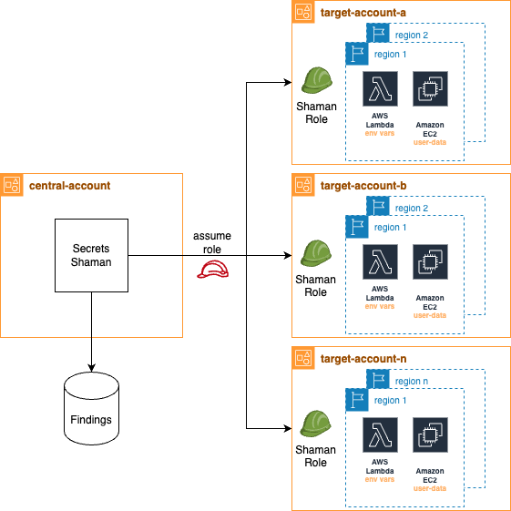

# Secret's Shaman
#### A secrets finding tool for some kind of AWS assets


## How it works
Secrets Shaman is a Python tool to detect some possible secret patterns on Lambda environments variables and EC2 instances user-data across all AWS Organizations accounts and declared regions. It might run as a simple script or also as a continuous assessment tool if it runs scheduled somewhere (I recommend to run as a K8s cronjob or scheduled Lambda Function)

<p align="center">

</p>

## Requisites
- Create a role or credentials on a central AWS account and give it assume role privileges on other account roles
- Create a role with same name in all account, with trust policy to enable assume role from the central account role. Give it sufficient privileges to audit Lambda environment and EC2 user data.
- Complete ORG_ACCOUNT_ID and SHAMAN_ROLE_NAME values on shaman_config.py

## How to run it
BE SURE YOU'RE COMPLYING THE PREVIOUS REQUISITES FIRST

### Running as script directly from cli:
```bash
$ git clone https://github.com/celagus/secrets-shaman
$ cd secrets-shaman
$ pip install -r requirements.txt
$ python main.py
```
### Running as container using docker:
```bash
$ git clone https://github.com/celagus/secrets-shaman
$ cd secrets-shaman
$ docker build -t shaman:latest .
$ docker run -ti -e AWS_ACCESS_KEY_ID=$AWS_ACCESS_KEY_ID -e AWS_SECRET_ACCESS_KEY=$AWS_SECRET_ACCESS_KEY -e AWS_SESSION_TOKEN=$AWS_SESSION_TOKEN shaman
```

## Current assets support
* EC2 Instances
* Lambda Functions
